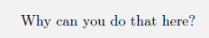

# Finding Your Way
> **Environment:**
>
> In the give environment we have a maze similar to that of project 1
> and our objective is to find a submarine drone with probability
> 1,using which we are required to shut down a hijacked nuclear reactor.
>
> The repair sub drone is capable of moving from cell to cell within the
> reactor. However, there is a catch here, we actually don't know at any
> point of time where exactly the drone is at, due to the access methods
> we gained. The only functionality we have achieved is being able to
> pass on instructions to the drone in which direction it should move.
> But we can neither know the present position nor get response on where
> it has moved after an instruction is passed.
>
> 
>
> **[Given Reactor Schematic:]{.underline}**
>
> 
>
> **[ANS:]{.underline}** Initially, we have no information on where the
> drone is, i.e., it can be anywhere in the cells that are open (Not
> walls), in the given schematic there are 199 Open cells. Therefore,
> the Probability that the drone is in the top left corner is 1/199.
>
> This is also the probability with which it can be in any of the open
> positions initially. So, we can initialize/fill the grid with 1/Open
> cells as the probability wherever it is Open.

\[Note: If the top-left corner is a wall then probability would be 0\]

Consider issuing the command \`DOWN\'. While you don\'t know exactly
where the drone is, you can say where it isn\'t - it isn\'t, for
instance, in the top left corner anymore.

**[ANS:]{.underline}** After passing few instructions and altering the
states we can observe that the drone is more likely to be stuck at a
wall. More precisely, greater the number of moves(directions), the drone
can move at a location, the less likely it is going to stay there,
accordingly wherever there are more walls around the drone restricting
its movement, the drone is more likely to be there, let's call these
states the Hotspots.

Let's perform the movement "Down" on the forementioned graph as
suggested and observe what happens:

+-----------------------------------------------------------------------+
| > {width="2.0680555555555555in" |
| > height="2.05in"}                                                    |
| >                                                                     |
| > Initial State of the reactor                                        |
|                                                                       |
| +------------------------------------------------------------------+  |
| | > Here Cyan is the initial cold state but as we pass             |  |
| | > instructions, we can observe that the probabilities they       |  |
| | > converge to the Hotspots                                       |  |
| +==================================================================+  |
| +------------------------------------------------------------------+  |
|                                                                       |
| > {width="2.0in" |
| > height="1.995832239720035in"}                                       |
+=======================================================================+
+-----------------------------------------------------------------------+

State of the reactor after move "DOWN" is applied.

Here, in our terms we can see by the movement down we were 100% sure
that the drone would not be at positions like (0,0) (7,0) (2,3) which
had no walls obstructing the down move and effectively the probability
that it would be stuck at positions like (5,0) (3,3) etc would increase
as the probability of the cell top to it gets added to it and the
probability inside itself remains there as it has nowhere to go due to
the wall. This way the heat of the position increases easily at
positions where there are more walls obstructing the movements.

You realize that by issuing a sequence of instructions, you may be able
to determine exactly where the drone is, and

thus, be able to use it to shut down the reactor.

We can find the exact location here as, whatever possible move we take
here converges the probabilities (rest of the moves\[up, down\] get
blocked by walls) and effectively the probabilities get trapped at the
ends of the grid.

One optimal way of doing it moving completely left 9 times or right 9
times.

I have understood the statement "many ways to formulate this" can't get
any better than this question,

**[Approach #1:]{.underline}** There was the brute force moves method
where I checked each set of moves possible which popped from my queue
and added the following steps to the queue and so on till, I iterated
throughout the whole maze. This approach worked fine and gave shortest
sequences of moves for smaller mazes. But once I started scaling this it
took forever to run.

So, I scraped this Idea, and thought of a greedy approach

**[Approach #2:]{.underline}** Here I simulate the 4 possible moves
where I allot a reward to each simulation depending on the number of
non-zero values(probabilities) left to converge and distance between
farthest nodes because as these values reduced, I observed that we moved
towards the goal state. But with this approach there was a point when
the convergence stopped as the reward was equal to all 4 moves, and it
couldn't decide which move to take. To resolve this, I added randomness
to the move which would cause a change in values i.e., whenever the
better move according to heuristic isn't changing the grid, I make a
move other

than that move, to create a change in values to keep the converging move
forward.

The best value seemed to be 215 steps, with the greedy approach

This seemed fine until I observed non-stability in the results, and
there were few cases where it took forever to converge although I
stopped immediate wiggling there were states which repeated and the heat
values didn't converge.

Then I observed the approach #1 was right and accurate but just slow,
which was the similar case we faced in for agent 2,3 in Project 1:Ghosts
in the maze.

> This is BFS, which to find the shortest path to a goal opened these
> many nodes(visited) represented in orange

To avoid this for agent 2 in project where we didn't need shortest path
just an optimised algorithm which gives results quicker than BFS was
required, Then there comes into play a variant of A\* algorithm which I
Used in Project 1, by providing a heuristic value which is more than the
actual heuristic, we make the A\* open much fewer nodes but the
trade-off is ,it does not guarantee the optimal or shortest path,
Effectively making it into a Best First Search Algorithm.

> Here, we can see that Best First Search, though it did not give the
> very best possible path, it opened way lesser nodes

Depending on the heuristic provided the path lies between optimum and
non-optimum with the trade-off being the computational time.

+-----------------------------------------------------------------------+
| > i.e., if you need faster results incline it towards Best first      |
| > search which will enable you to get quick results but not optimal   |
| > path, if you provide better heuristic, it will ensure you take the  |
| > optimum path but will take more time to compute.                    |
+=======================================================================+
+-----------------------------------------------------------------------+

> **[ANS 3):]{.underline}**The Code is attached in the zip and is a
> IPYNB file, it has visualisations and necessary outputs.
>
> Name the input file as input1.txt and place in the same directory and
> it works
>
> **[Final Approach:]{.underline}** The first approach where I used BFS
> of the state, instead of that, I used A\*/Best First Search Approach,
> because I understood that A\*/Best First Search will give me an
> optimal/almost optimal path in very less time.
>
> The heuristic here from the observations involves:
>
> 1.We need to minimize the number of non-zero, which means they
> converged, and we are reaching to our end state.
>
> 2.We need to decrease the distance between the farthest positioned
> probabilities because doing this ensures that they are nearby and
> ready to converge.
>
> Using this 2 information I applied the heuristic convergence and
> achieved a result that was optimal than my greedy approach, and the
> results are very quick.
>
> Initially, I took the distances to be Manhattan distances between the
> points, but I later realized that the node must travel a BFS distance
> (shortest distance) to converge with the farthest node.
>
> So, instead of Calculating BFS each time I pre-calculated the BFS for
> all open points in the grid to all open points and stored them for
> later usage and computational speed.
>
> Upon adding this improvement, to the heuristic I observed a dip in
> speed, this showed my heuristic was moving towards A\* and away from
> Best first search and the result of 208 steps confirmed that it was
> optimal than before.
>
> Upon, trying to improve more, I remembered that the primary thing we
> are trying to reduce is the number of steps. So, including the number
> of steps in the heuristics and I had various trial and errors for the
> importance level of each of these metrics, using them properly in the
> heuristic enabled me to go even lower to a value of 135 steps.
>
> Since the A\* variant uses a heap which pops out the state with
> minimum value the more we improve the heuristic the optimal results we
> get. So, this way I can say that the result obtained is an optimal
> sequence.

The Sequence of steps for given question is:

**[Representation and Final Result:]{.underline}**

An in-between state with cold and hotspots denoted accordingly from cyan
being least likely to red being most likely

The point at which it converges in the end

Strategy to implement a maze generator which would be depending on the
following statements:

> 1.Note that if the reactor had no internal separators and was totally
> empty, it would be easy to locate the drone; similarly, if the reactor
> had maximal internal separators to the point where only one cell was
> unblocked, it would be easy to locate the drone. The solution must be
> somewhere in the middle.
>
> 2.So, we know heuristic search is optimal, but whenever the heuristic
> is not admissible its ends up opening a greater number of nodes and if
> its admissible and more than actual value it ends up giving the longer
> path.

Consider the heuristic of Problem 3 we understood that we are far away
from the solution (the sequence is still left) based on these metrics

> 1.We need to minimize the number of non-zero, which means they
> converged, and we are reaching to our end state.
>
> 2.We need to decrease the distance between the farthest positioned
> probabilities because doing this ensures that they are nearby and
> ready to converge.
>
> 3.The length of sequence of moves has also to be minimized

So, for a maze we need to make the initial starting BFS distance as
maximum as possible so re-iterating Statement 2, if we can make that
longest path as the only path that's one way, we can make sure the
sequence of steps is maximized

Also the number of non-zero values present means, that you are that far
from the solution. Similarly, information is given from Statement 1, we
understand that number of open cells play a part too so add that to the
heuristic while generating the maze and maintaining an optimum value
helps

Also having a ,maze structure with walls blocking most of the cells when
any direction move help to reduce the number of cell converging and
therefore maximize the number of steps required.

Shortest path calculated by A\*

Shortest Path by Best First Search

We can observe that the only path to the goal is the longest path, given
A\* gave shortest path and yet it is same as the Best first Search

Having a grid like this would mean:

> 1.The Open Cells are not too high and not too low just optimal 2.The
> Distance between Farthest Nodes is also high\
> 3.The only path to the goal node is the shortest path

Therefore, by proofs above I can confirm that the above grid is one of
the grids with most longest sequence of steps to complete
